# 🎓 PYQ Insight – AI-Powered Question Paper & Syllabus Analysis Engine

[](https://pyq-insight.streamlit.app/)


> 🏆 **AI First Hackathon 2026 (Summer School '26)**  
> **Track:** AI for Education & Skill Development  
> **Organized by:** Institute Incubation & Innovation Council (I3C) – IIT Jammu × Techible  
> **Team Name:** `CADevelopers`  
> 🗓️ **Development Sprint Window:** July 23, 2026 – July 26, 2026

*Turn stacks of old question papers into a clear, data-backed study plan automatically.*


---

📩 **Contact:** `sayyedmtalha@gmail.com`  
🔗 **Live App:** [(https://pyq-insight.streamlit.app/)](https://pyq-insight.streamlit.app/)

---

## 📌 Problem & Opportunity

### The Problem
Students preparing for university and college exams manually flip through years of past papers attempting to guess which topics matter — a slow, error-prone process repeated by every student, every semester, for every subject.

- **Who is affected:** Every student preparing for internal, semester, or competitive exams, especially in college courses where past papers are scattered, inconsistent, and never formally analyzed.
- **What's broken today:** Existing PYQ analysis tools (e.g., ANALYXX, UPSC.ai) exclusively target large standardized competitive exams (JEE / NEET / UPSC). University/college-specific subject exams are completely underserved.
- **Why it matters now:** With exam preparation windows increasingly compressed, students need to prioritize study effort with data, not guess at it.
- **What happens if unsolved:** Students keep over-studying low-yield topics and under-preparing for high-frequency ones, purely due to a lack of visibility into real exam patterns.

---

## 💡 The Proposed Solution

**PYQ Insight** is an AI agent that accepts uploaded PYQ PDFs alongside a subject's syllabus, producing an interactive, downloadable Excel workbook with topic-wise frequency analysis, trend detection, and syllabus gap analysis.

### 🌟 What Makes PYQ Insight Different & Innovative

1. 🔍 **Syllabus-First Gap Analysis:** Identifies topics that have *never been tested* in past papers, rather than just performing basic PYQ frequency counting.
2. 📊 **Owned, Editable Excel Deliverable:** Unlike closed web dashboards, PYQ Insight outputs an editable openpyxl Excel file reusable by teachers, students, and coaching institutes to build custom study materials.
3. 🏫 **Built for College & University Exams:** Specifically engineered to parse noisy, inconsistent, and non-standardized college exam papers.
4. 🧠 **3-Tier Zero-Downtime LLM Engine:** Seamless failover across **Groq LPU**, **Mistral AI**, and **Gemini 2.0 Flash** ensures reliable execution without hitting API rate limits.

---

## 🏆 Evaluation Criteria Alignment

| Evaluation Criteria | Weightage | PYQ Insight Implementation Highlights |
| :--- | :---: | :--- |
| **Technical Implementation** | **30%** | Dual extraction engine (PyMuPDF native text + Mistral OCR API fallback), sub-question regex parser (`1a`, `2b'`), and automated `openpyxl` Excel workbook generator with custom conditional formatting. |
| **AI Integration & Innovation** | **25%** | 3-tier zero-downtime failover engine (**Groq LPU** $\rightarrow$ **Mistral AI** $\rightarrow$ **Gemini 2.0 Flash**) enforcing strict Course Outcome (CO) / Unit boundaries for dynamic syllabus taxonomy mapping. |
| **User Experience & Design** | **15%** | Claude-inspired dark-slate Streamlit UI featuring drag-and-drop batch PDF parsing, live pipeline status, and immediate Excel workbook downloads. |
| **Feasibility & Scalability** | **15%** | Fully decoupled modular architecture with rate-limit resilient failover, stateless execution, and single-click Streamlit Cloud hosting readiness. |
| **Final Pitch & Demo** | **15%** | End-to-end demo readiness with sample PDFs, unit test coverage, and complete architectural documentation. |

---

## ✨ Key Features

- 📄 **Granular Sub-Question Extraction**: Parses exam papers down to exact sub-question parts (`1(a)`, `2(b')`, `3(c)iii`) rather than merging them into broad parent blocks.
- 🛡️ **Strict Mark Weightage Extractor**: Parses explicit mark brackets (`[07]`, `(8M)`, `[2 x 4 marks]`) and strictly excludes problem text variables (`500 K`, `100 kPa`, `2024`, `$1000`) from mark totals.
- 🎯 **Enforced Module / Unit / CO Boundaries**: Questions declared under `CO1`, `CO2`, `Unit II`, etc., are mapped **strictly within their designated Unit/CO boundary**, preventing cross-unit misclassification.
- 🧠 **3-Tier Zero-Downtime LLM Engine**:
  1. **Primary**: Groq LPU (`llama-3.3-70b-versatile`) – Ultra-fast inference.
  2. **Secondary**: Mistral AI (`mistral-small-latest`) – Robust LLM chat completions.
  3. **Tertiary**: Gemini 2.0 Flash (`gemini-2.0-flash`) – Ultimate failover backup.
- 📊 **Row-by-Row Excel Analytics Workbooks**:
  - **Topic Analysis Sheet**: Row-by-row syllabus subtopic breakdown with Frequency (Times Asked), Total Marks, Primary Question Type (`Theoretical`, `Derivation`, `Numerical`), Importance Rating (`Critical`, `High`, `Medium`, `Low`), and year-by-year question columns.
  - **Summary Sheet**: Overall subject statistics and gap analysis (never-tested syllabus topics).
- 🎨 **Claude-Inspired Dark Slate Streamlit UI**: Sleek, modern web application ready for single-click deployment on Streamlit Cloud.

---

## 🏗️ Architecture & Processing Workflow

```mermaid
flowchart TD
    classDef inputStyle fill:#1e293b,stroke:#3b82f6,stroke-width:2px,color:#fff;
    classDef extractStyle fill:#0f172a,stroke:#8b5cf6,stroke-width:2px,color:#fff;
    classDef llmStyle fill:#18181b,stroke:#e11d48,stroke-width:2px,color:#fff;
    classDef classifyStyle fill:#022c22,stroke:#10b981,stroke-width:2px,color:#fff;
    classDef excelStyle fill:#14532d,stroke:#22c55e,stroke-width:2px,color:#fff;

    subgraph IN ["1. Input Data Stage"]
        PDFs["Exam Question PDFs<br/>(e.g., A 22-23.pdf, A 23-24.pdf)"]:::inputStyle
        Syllabus["Subject Syllabus Text<br/>(Units, COs & Subtopics)"]:::inputStyle
    end

    subgraph EXT ["2. PDF Text & Question Extraction"]
        PDFs --> NativePDF{Native PDF Text Extractable?}
        NativePDF -- Yes --> PyMuPDF["PyMuPDF Text Reader"]:::extractStyle
        NativePDF -- No / Force OCR --> MistralOCR["Mistral OCR API<br/>(mistral-ocr-latest)"]:::extractStyle
        
        PyMuPDF --> CleanNoise["Clean OCR Header Noise<br/>(Remove exam boilerplate, dates)"]:::extractStyle
        MistralOCR --> CleanNoise
        
        CleanNoise --> LLM_Extract["Question Parser<br/>(question_parser.py)"]:::extractStyle
        LLM_Extract --> SubParts["Extract Sub-part Granularity<br/>(1a, 1b, 2c) & Unit/CO Tags"]:::extractStyle
        LLM_Extract --> StrictMarks["Strict Mark Extractor<br/>(Parse marks; exclude variables)"]:::extractStyle
    end

    subgraph TAX ["3. Dynamic Syllabus Taxonomy"]
        Syllabus --> TaxBuilder["Taxonomy Builder<br/>(build_taxonomy_from_syllabus)"]:::classifyStyle
        TaxBuilder --> UnitMap["Structured Unit/CO Buckets<br/>(Unit I - CO1, Unit II - CO2...)"]:::classifyStyle
    end

    subgraph LLM_TIER ["4. 3-Tier LLM Provider Failover Engine"]
        LLM_Engine["Smart Classifier Prompt<br/>(classifier.py)"]:::llmStyle
        SubParts --> LLM_Engine
        StrictMarks --> LLM_Engine
        UnitMap --> LLM_Engine
        
        LLM_Engine --> Groq{"1. Groq LPU<br/>(llama-3.3-70b-versatile)"}:::llmStyle
        Groq -- Success --> ParseJSON["Universal JSON Parser"]:::llmStyle
        Groq -- Rate Limit / 429 --> MistralLLM{"2. Mistral AI API<br/>(mistral-small-latest)"}:::llmStyle
        
        MistralLLM -- Success --> ParseJSON
        MistralLLM -- Error / 429 --> Gemini{"3. Gemini 2.0 Flash"}:::llmStyle
        
        Gemini -- Success --> ParseJSON
        Gemini -- Fallback --> PhraseMatch["Local Keyword Scoring<br/>(Strict Unit Boundary Fallback)"]:::llmStyle
    end

    subgraph AGG ["5. Aggregation & Deduplication"]
        ParseJSON --> BoundaryCheck["Enforce Strict Unit/CO Boundaries<br/>(CO2 Question strictly in Unit II)"]:::classifyStyle
        PhraseMatch --> BoundaryCheck
        
        BoundaryCheck --> TypeInfer["Determine Primary Type<br/>(Theoretical, Derivation, Numerical)"]:::classifyStyle
        TypeInfer --> Deduplication["Deduplicate Variant Papers<br/>(Fuzzy Similarity >= 85%)"]:::classifyStyle
    end

    subgraph OUT ["6. Excel Workbook Generation"]
        Deduplication --> ExcelBuilder["Excel Builder<br/>(excel_builder.py)"]:::excelStyle
        
        ExcelBuilder --> TopicSheet["Topic Analysis Sheet<br/>- Row-by-Row Subtopics<br/>- Frequency & Total Marks<br/>- Critical / High / Medium / Low"]:::excelStyle
        ExcelBuilder --> SummarySheet["Summary & Gap Analysis Sheet<br/>- Subject Weightage Distribution<br/>- Never-Tested Syllabus Topics"]:::excelStyle
    end
```



---

## 📁 Repository Structure

```
pyq-insight/
├── app.py                  # Streamlit Web Application Interface
├── pipeline.py             # Core End-to-End Orchestrator Pipeline
├── pdf_extraction.py       # PyMuPDF Native Text & Mistral OCR Fallback
├── mistral_ocr_client.py   # Mistral Document OCR API Client
├── question_parser.py      # Sub-question & Mark Parsing Logic
├── classifier.py           # LLM-Driven Smart Classifier & Taxonomy Builder
├── aggregator.py           # Variant Paper Deduplication & Aggregation
├── excel_builder.py        # Multi-sheet Openpyxl Excel Workbook Generator
├── groq_client.py          # Primary Groq LPU Client & Provider Failover
├── mistral_client.py       # Secondary Mistral AI Chat Completions Client
├── gemini_client.py        # Tertiary Gemini 2.0 Flash Fallback Client
├── requirements.txt        # Production Dependencies for Deployment
├── README.md               # Documentation & Setup Guide
└── tests/                  # Unit Test Suite
```

---

## 💻 Local Installation & Setup

### Prerequisites
- Python 3.10 or higher
- API Keys for Groq, Mistral, and/or Gemini

### 1. Clone the Repository
```bash
git clone https://github.com/sayyedmtalha/pyq-insight.git
cd pyq-insight
```

### 2. Create Virtual Environment & Install Dependencies
```bash
# macOS/Linux
python3 -m venv .venv
source .venv/bin/activate

# Windows (PowerShell)
python -m venv .venv
.\.venv\Scripts\Activate.ps1

# Install requirements
pip install -r requirements.txt
```

### 3. Configure Local Secrets
Copy the template or create `.streamlit/secrets.toml`:

```toml
GROQ_API_KEY = "your_groq_api_key_here"
MISTRAL_API_KEY = "your_mistral_api_key_here"
GEMINI_API_KEY = "your_gemini_api_key_here"
```

### 4. Run Application
```bash
streamlit run app.py
```
Open your browser at `http://localhost:8501`.

---

## 🧪 Running Unit Tests

To verify parsing, classification, and boundary enforcement rules locally:

```bash
python -m unittest discover -s tests
```

---

## 📜 License

Distributed under the MIT License.
